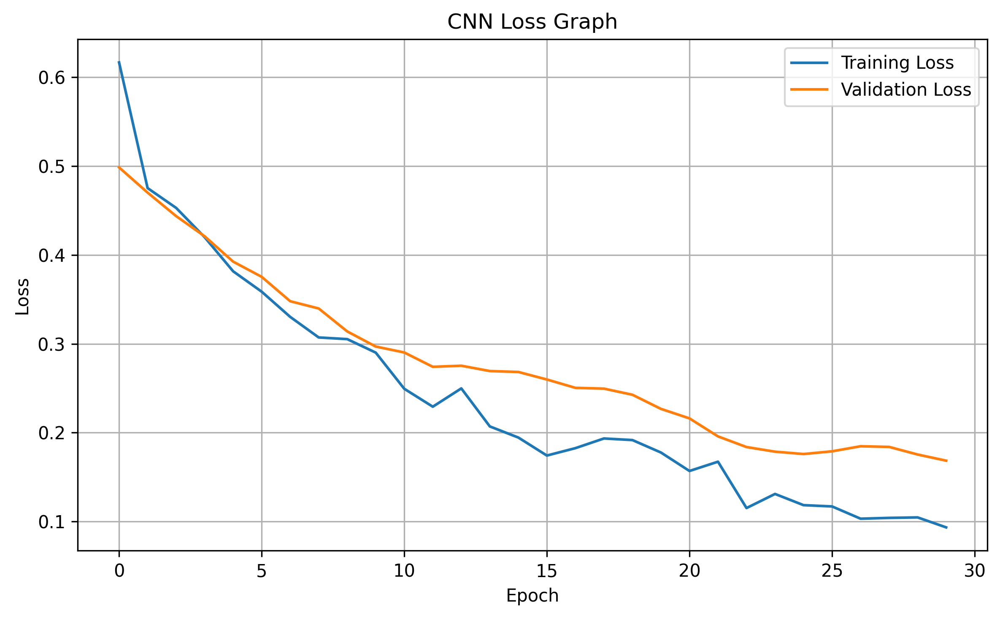

# 🌍 Global Pollution Analysis and Energy Recovery using Apriori Algorithm

## 🧠 Pollution Pattern Discovery, Energy Recovery Analytics, Apriori Association Rule Mining & CNN-Based Pollution Severity Classification

---

## 👤 Author

**Sagnik Patra**

---

## 📌 Project Overview

This project builds an end-to-end **Global Pollution Analysis and Energy Recovery System** using **Apriori Association Rule Mining**, **Convolutional Neural Networks (CNN)**, and **Machine Learning Validation Techniques**.

The system analyzes global pollution indicators including **Air Pollution**, **Water Pollution**, **Soil Pollution**, **Energy Consumption**, and **Energy Recovery Metrics** to discover hidden relationships between pollution severity and energy recovery strategies.

Using the **Apriori Algorithm**, the project identifies frequent pollution patterns and extracts meaningful association rules that can support environmental policy decisions. Additionally, a **CNN model** is trained to classify pollution severity categories, enabling predictive environmental analytics.

The project automatically performs:

- Data Cleaning and Preprocessing
- Pollution Feature Engineering
- Pollution Severity Categorization
- Energy Recovery Analytics
- Apriori Frequent Itemset Mining
- Association Rule Generation
- Rule Validation and Cross Validation
- CNN-Based Pollution Severity Classification
- Model Comparison and Evaluation
- Automated Visualization Generation
- Report Generation

---



---

## 🎯 Objectives

### Environmental Data Analysis

- Analyze global pollution indicators
- Understand relationships among air, water, and soil pollution
- Examine energy recovery effectiveness across countries
- Discover pollution-energy recovery trends

### Feature Engineering

- Generate energy recovery per capita
- Create energy efficiency metrics
- Calculate average pollution scores
- Categorize pollution severity levels

### Association Rule Mining

- Apply Apriori Algorithm
- Discover frequent pollution-energy patterns
- Generate association rules
- Evaluate support, confidence, and lift

### CNN-Based Classification

- Convert tabular pollution data into image-like matrices
- Train CNN model for pollution severity prediction
- Evaluate classification performance
- Compare CNN against traditional machine learning methods

### Model Validation

- Train-Test Validation
- K-Fold Cross Validation
- Rule Accuracy Assessment
- Statistical Significance Evaluation

### Reporting and Insights

- Generate visual analytics
- Produce actionable environmental recommendations
- Create automated reports
- Support pollution control strategy planning

---

# 📂 Dataset

Dataset Used:

```text
Global_Pollution_Analysis.csv
```

The dataset contains environmental indicators such as:

- Country
- Year
- Air Pollution Index
- Water Pollution Index
- Soil Pollution Index
- Energy Consumption
- Energy Recovery
- Population
- Environmental Metrics

---

# ⚙️ Project Workflow

## Phase 1 — Data Preprocessing and Feature Engineering

### Data Import

- Load pollution dataset
- Inspect structure and data types
- Generate dataset summary

### Missing Value Handling

- Numerical Features → Mean Imputation
- Categorical Features → Mode Imputation

### Data Cleaning

- Duplicate removal
- Column standardization
- Consistency checking

### Feature Scaling

Normalization applied using:

```python
MinMaxScaler()
```

Features scaled:

- Air Pollution Index
- Water Pollution Index
- Soil Pollution Index
- Average Pollution Index
- Energy Recovery Per Capita
- Energy Efficiency Score

---

## Feature Engineering

### Energy Recovered Per Capita

```text
Energy Recovered / Population
```

### Average Pollution Index

```text
(Air + Water + Soil) / 3
```

### Energy Efficiency Score

```text
Energy Recovery / Energy Consumption
```

### Pollution Severity Categories

| Pollution Index | Category |
|----------------|----------|
| Low | Low |
| Medium | Medium |
| High | High |

Generated categories:

- Air Severity
- Water Severity
- Soil Severity
- Overall Severity

---

# 🔍 Phase 2 — Apriori Algorithm

## Frequent Itemset Mining

The Apriori Algorithm identifies common pollution-energy combinations.

### Minimum Support

```python
0.05
```

### Frequent Itemsets Generated

Examples:

```text
Air_High
Water_High
Energy_High_Recovery
Overall_High
```

---

## Association Rule Mining

Rules are generated using:

```python
association_rules()
```

### Minimum Confidence

```python
0.40
```

Generated metrics:

- Support
- Confidence
- Lift
- Leverage
- Conviction

---

## Rule Interpretation

Example:

```text
Air_High + Water_High
→ High Energy Recovery
```

Meaning:

Countries with severe air and water pollution frequently exhibit high energy recovery activities.

---

# 🤖 Phase 3 — CNN Pollution Severity Classification

## Objective

Predict pollution severity classes using CNN.

### Input Transformation

Tabular environmental features are transformed into image-like matrices.

### CNN Architecture

```text
Input Layer
↓
Conv2D (32)
↓
MaxPooling
↓
Dropout
↓
Conv2D (64)
↓
Flatten
↓
Dense (64)
↓
Dropout
↓
Output Layer
```

### Activation Functions

```python
ReLU
Softmax
```

### Optimizer

```python
Adam
```

### Loss Function

```python
Categorical Crossentropy
```

---

# 📊 Phase 4 — Model Evaluation

## Apriori Evaluation Metrics

### Support

Measures frequency of occurrence.

```text
Support(A → B)
```

### Confidence

Measures rule reliability.

```text
Confidence(A → B)
```

### Lift

Measures rule usefulness.

```text
Lift(A → B)
```

---

## CNN Evaluation Metrics

### Classification Accuracy

Measures prediction correctness.

### Confusion Matrix

Shows:

- True Positives
- True Negatives
- False Positives
- False Negatives

### ROC Curve

Measures classification performance across thresholds.

### Classification Report

Includes:

- Precision
- Recall
- F1 Score
- Accuracy

---

# 🔄 Cross Validation

## Train-Test Validation

```text
80% Training
20% Testing
```

## K-Fold Cross Validation

```text
5-Fold Cross Validation
```

Evaluates:

- Rule Accuracy
- Confidence Stability
- Lift Consistency

---

# 📈 Generated Outputs

## CSV Files

### Dataset Files

- apriori_raw_dataset.csv
- apriori_cleaned_dataset.csv
- apriori_normalized_dataset.csv
- apriori_encoded_dataset.csv
- apriori_feature_engineered_dataset.csv

### Apriori Outputs

- apriori_transaction_matrix.csv
- apriori_frequent_itemsets.csv
- apriori_association_rules.csv
- apriori_apriori_validation_results.csv
- apriori_apriori_cross_validation_results.csv

### CNN Outputs

- apriori_cnn_prediction_results.csv
- apriori_cnn_classification_report.csv

### Comparison Outputs

- apriori_model_comparison_results.csv

---

## Graph Outputs

### Pollution Analytics

- apriori_pollution_trend_graph.png
- apriori_correlation_heatmap.png

### Apriori Graphs

- apriori_frequent_itemsets_graph.png
- apriori_association_rules_scatter_graph.png
- apriori_association_rules_lift_graph.png
- apriori_apriori_cross_validation_graph.png

### CNN Graphs

- apriori_cnn_accuracy_graph.png
- apriori_cnn_loss_graph.png
- apriori_cnn_confusion_matrix.png
- apriori_cnn_roc_curve.png
- apriori_cnn_actual_vs_predicted_graph.png

### Model Comparison

- apriori_model_comparison_graph.png

---

## Model Files

### Deep Learning Model

```text
apriori_cnn_pollution_model.h5
```

---

## Configuration Files

### JSON

```text
apriori_project_summary.json
```

### YAML

```text
apriori_project_config.yaml
```

---

## Report Files

```text
apriori_final_report.md
```

---

# 📊 Key Insights

The Apriori Algorithm helps identify:

- High pollution regions with strong energy recovery activity
- Relationships among air, water, and soil pollution
- Frequent environmental patterns
- Pollution severity clusters

The CNN model provides:

- Pollution severity prediction
- Automated environmental classification
- Data-driven forecasting capability

Together, Apriori and CNN offer:

- Explainable Rule Mining
- Predictive Environmental Analytics
- Strategic Decision Support

---

# 🌱 Environmental Recommendations

### Pollution Control

- Prioritize regions with severe pollution and low recovery rates.
- Increase renewable energy adoption in high-pollution countries.
- Implement targeted pollution reduction strategies.

### Energy Recovery Optimization

- Expand waste-to-energy initiatives.
- Improve recycling and recovery technologies.
- Encourage sustainable energy recovery programs.

### Policy Planning

- Use association rules to identify recurring environmental patterns.
- Monitor pollution severity trends yearly.
- Invest in pollution mitigation where rules indicate persistent risks.

---

# 🛠️ Technologies Used

## Programming Language

- Python 3.x

## Data Processing

- NumPy
- Pandas

## Machine Learning

- Scikit-Learn

## Deep Learning

- TensorFlow
- Keras

## Association Rule Mining

- Mlxtend

## Visualization

- Matplotlib
- Seaborn

## Configuration Management

- JSON
- YAML

---

# 🚀 How to Run

## Install Dependencies

```bash
pip install pandas numpy matplotlib seaborn scikit-learn mlxtend tensorflow pyyaml
```

## Run Project

```bash
python pollution_apriori_cnn.py
```

Outputs will automatically be saved in:

```text
Global Pollution Analysis and Energy Recovery using Apriori Algorithm/
```

---

# 📚 Conclusion

This project successfully combines **Apriori Association Rule Mining**, **CNN-Based Pollution Severity Classification**, and **Environmental Data Analytics** to uncover meaningful pollution-energy relationships and generate actionable insights for sustainable environmental management.

The framework provides both:

- Explainable Rule-Based Knowledge Discovery
- Predictive Deep Learning Capabilities

making it a comprehensive solution for global pollution analysis and energy recovery optimization.

---

## ⭐ Future Enhancements

- FP-Growth Algorithm
- XGBoost Classification
- LSTM-Based Pollution Forecasting
- Real-Time Environmental Monitoring
- GIS-Based Pollution Mapping
- Explainable AI (XAI)
- Dashboard Deployment using Streamlit

---

**Author:** Sagnik Patra

**Project:** Global Pollution Analysis and Energy Recovery using Apriori Algorithm & CNN

**Technology Stack:** Python, Apriori, CNN, TensorFlow, Scikit-Learn, Mlxtend, Pandas, NumPy, Matplotlib, Seaborn
